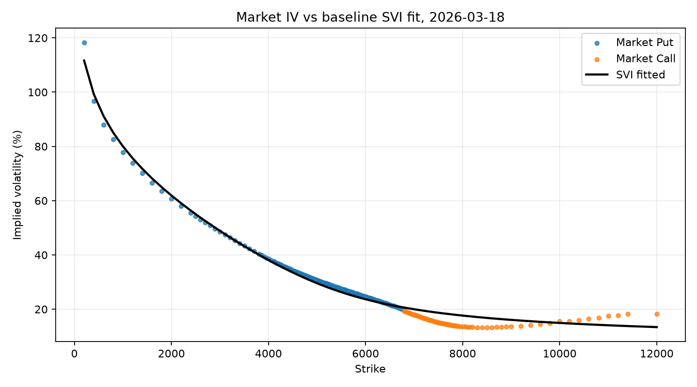
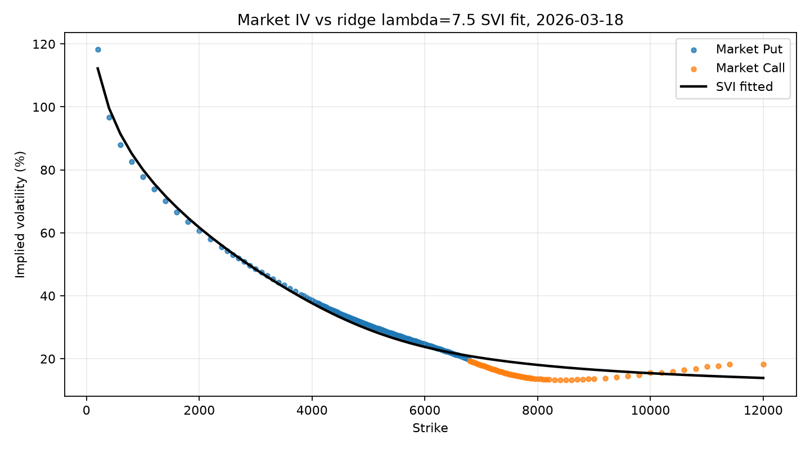
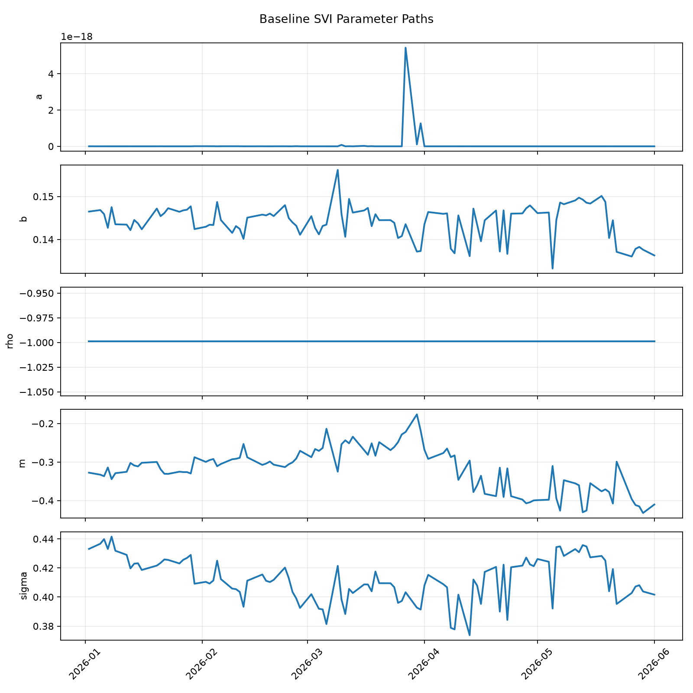
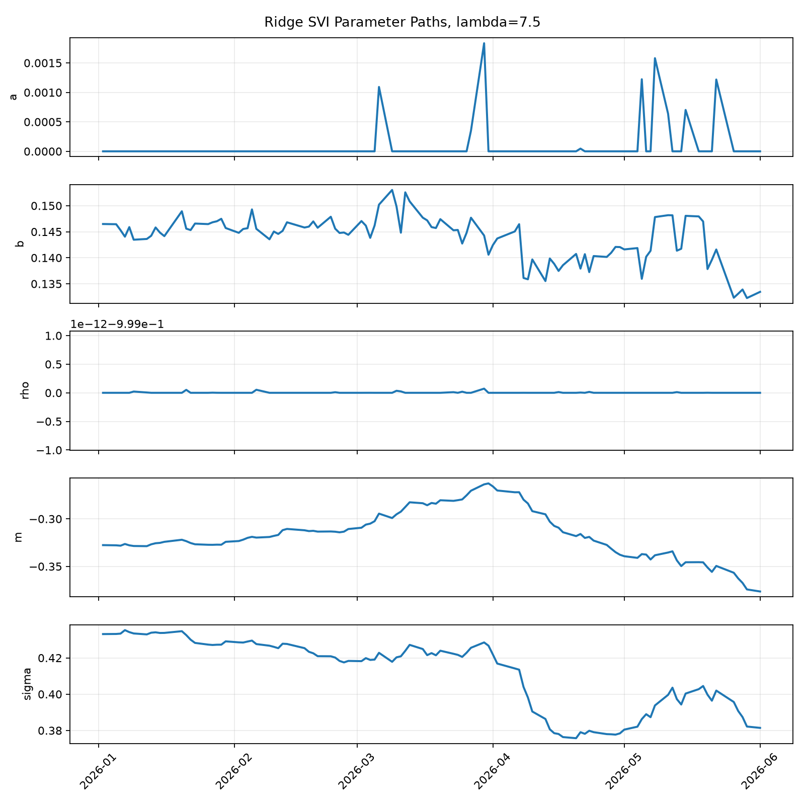
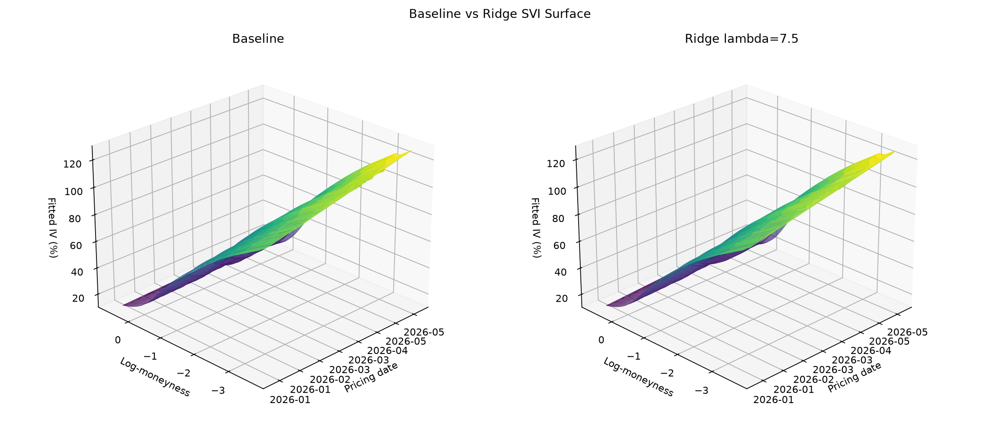

# SVI Implied Volatility Calibration

This project calibrates daily SVI volatility smiles for ES options and compares independent baseline fits against ridge-regularized fits over time.

## Project Status

- Data cleaning and calibration dataset: done
- Baseline SVI calibration: done
- Ridge SVI calibration across lambda values: done
- Baseline and ridge plots: done

## Data

Inputs:

- `data/options_data.csv`
- `data/spx_futures.csv`

Processed outputs:

- `data/processed/calibration_data.csv`
- `data/processed/baseline_svi_parameters.csv`
- `data/processed/fitted_values.csv`
- `data/processed/diagnostics.csv`
- `data/processed/ridge_svi_parameters.csv`
- `data/processed/ridge_fitted_values.csv`
- `data/processed/ridge_diagnostics.csv`
- `data/processed/ridge_summary.csv`

Current setup uses ES options matched to the `ESZ26 Index` futures contract because the option expiry matches the ESZ26 futures last trading date.

## Method

The SVI total variance parameterization is:

```text
w(k) = a + b * (rho * (k - m) + sqrt((k - m)^2 + sigma^2))
```

where:

- `k` is log-moneyness
- `w(k)` is total implied variance
- `a, b, rho, m, sigma` are SVI parameters

Baseline calibration fits each pricing date independently.

Ridge calibration fits each pricing date while penalizing movement away from the previous fitted parameter vector:

```text
loss_t = fit_error_t + lambda_ridge * ||theta_t - theta_previous||^2
```

## Key Result

The selected working value is:

```text
lambda_ridge = 7.5
```

At this value, ridge calibration gives much smoother parameter paths while keeping mean IV RMSE close to the baseline result.

## Tables

### Ridge Lambda Summary

| Lambda | Fits | Successes | Mean RMSE IV | Mean Parameter Jump |
| ---: | ---: | ---: | ---: | ---: |
| 0.1 | 103 | 103 | 0.022367 | 0.020132 |
| 1.0 | 103 | 103 | 0.022281 | 0.009910 |
| 5.0 | 103 | 103 | 0.022189 | 0.005312 |
| 7.5 | 103 | 103 | 0.022333 | 0.004463 |
| 10.0 | 103 | 103 | 0.022505 | 0.003955 |

## Important Figures

### Baseline IV Smile



### Ridge IV Smile, Lambda 7.5



### Baseline Parameter Paths



### Ridge Parameter Paths, Lambda 7.5



### Baseline vs Ridge SVI Surface



## How To Run

Run the full pipeline from the project root:

```bash
./.venv/bin/python src/data_cleaning.py
./.venv/bin/python src/calibration.py
./.venv/bin/python src/ridge_calibration.py
./.venv/bin/python src/plotting.py
```

## Repository Structure

```text
data/
  processed/
report/
  figures/
  tables/
src/
  data_cleaning.py
  svi.py
  calibration.py
  ridge_calibration.py
  plotting.py
```